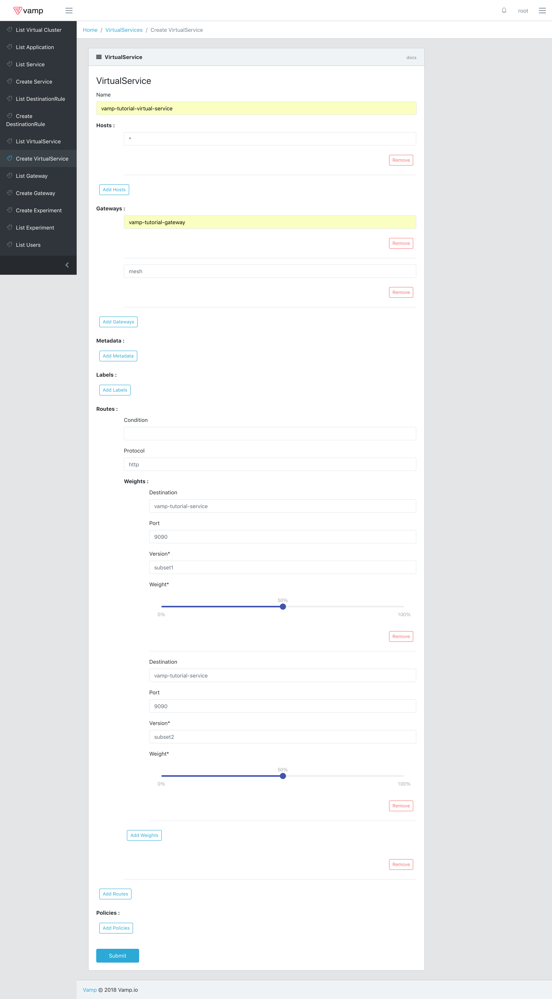
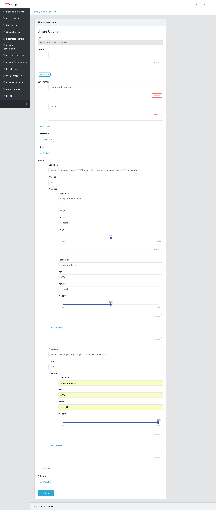
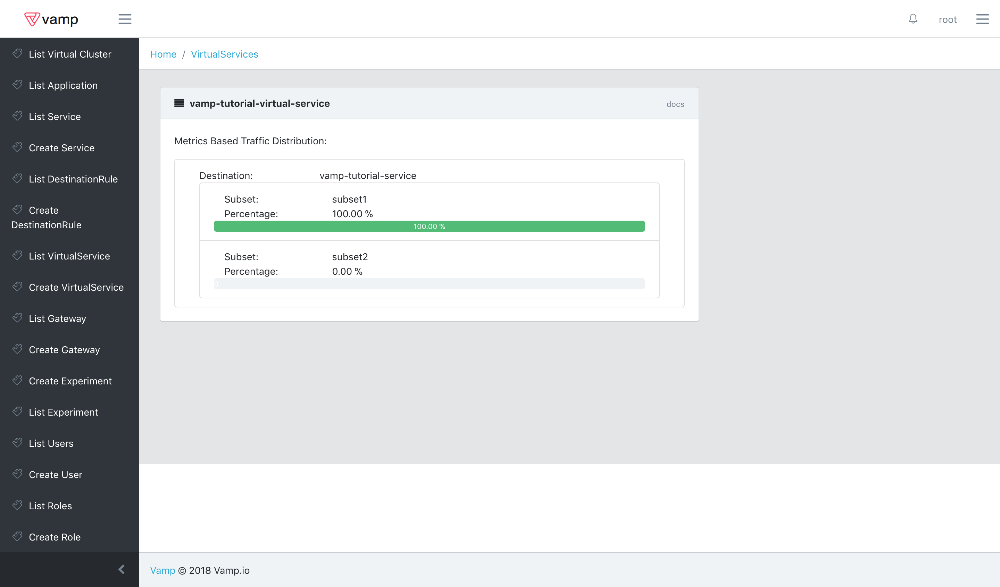

# Vamp Lamia Alpha

Lamia is a single Docker container that provides a REST API and React-based UI that you can use to:

- gradually roll-out a new version of a service;
- automatically rollback to the original version, in the case of errors; and
- apply routing conditions.

This Guide will help you set up Lamia on a kubernetes cluster.

## Table of contents

   * [Prerequisites](#prerequisites)
   * [installation steps](#installation-steps)
      * [Istio Setup](#istio-setup)
      * [Terminology](#terminology)
      * [Performing a canary release](#performing-a-canary-release)
         * [Requirements](#requirements)
         * [Exposing your application](#exposing-your-application)
         * [Creating a Gateway](#creating-a-gateway)
         * [Performing a Canary Release](#performing-a-canary-release-1)
            * [Metric based canary release](#metric-based-canary-release)
            * [Custom canary release](#custom-canary-release)
      * [API](#api)

## Installation

### Prerequisites 
* An existing kubernetes cluster with Kubernetes version 1.9 or above installed. 
* The current version has been tested only on Google Cloud, so it's recommended that you use that as well, in order to avoid issues.
* Kubectl should be installed on the local computer with authorizations to access the cluster.

**Keep in mind that this is an Alpha release targeted at developers and dev/ops. Many of the features are currently limited and will likely change and improve in future versions.**

### Installation steps

git clone this repo or download [setup.zip](https://github.com/magneticio/vamp2setup/releases/download/pre0.0.1/setup.zip)

```
git clone https://github.com/magneticio/vamp2setup.git
```
or
```
wget https://github.com/magneticio/vamp2setup/releases/download/pre0.0.1/setup.zip
unzip setup.zip
```

Run:
```
./vamp-bootstrap.sh
```

Enter password when asked, password will not be visible and it will be asked twice.

Installer will tell you where to connect like:

```
use http://111.122.133.144:8888 to connect
```

If you need to retrieve the IP afterwards you can do it via kubectl

```
kubectl get svc vamp -n=vamp-system
```

Copy the url and paste on your browser and add /ui/#/login

http://111.122.133.144:8888/ui/#/login 

to login and start using.

The default username is root.


### Istio Setup

Once installed, Lamia will automatically check for Istio on the default cluster.
Lamia expects to find the following resources inside the istio-system namesapce:

**Deployments:**

- grafana                   
- istio-citadel             
- istio-egressgateway       
- istio-ingressgateway      
- istio-pilot               
- istio-policy              
- istio-sidecar-injector    
- istio-statsd-prom-bridge  
- istio-telemetry           
- istio-tracing             
- prometheus                
- servicegraph      

**Services:**

- grafana                   
- istio-citadel             
- istio-egressgateway       
- istio-ingressgateway      
- istio-pilot               
- istio-policy              
- istio-sidecar-injector    
- istio-statsd-prom-bridge  
- istio-telemetry           
- prometheus                
- prometheus-external       
- servicegraph              
- tracing                   
- zipkin                    

**Service Accounts:**

- default
- istio-citadel-service-account          
- istio-cleanup-old-ca-service-account   
- istio-egressgateway-service-account    
- istio-ingressgateway-service-account   
- istio-mixer-post-install-account       
- istio-mixer-service-account            
- istio-pilot-service-account            
- istio-sidecar-injector-service-account 
- prometheus   

**ConfigMaps:**

- istio                                   
- istio-ingress-controller-leader-istio   
- istio-mixer-custom-resources            
- istio-sidecar-injector                  
- istio-statsd-prom-bridge                
- prometheus                              

and the following int he logging namespace

**Deployments:**

- elasticsearch  
- fluentd-es     
- kibana         

**Services:**

- elasticsearch         
- elasticsearch-external
- fluentd-es            
- kibana                             

**ConfigMaps:**

- fluentd-es-config
- mapping-config

If any of these resources are missing, Lamia will try to install Istio.

**Keep in mind that if you have pre-existing deployments, then after the installation is complete, you will need to restart them or trigger a rolling update in order for the Istio Sidecar to be injected.**

## Terminology

To get a better understanding of how Lamia works you should keep in mind the meaning of the following terms.
Most of them overlap completely with kubernetes entities, but some don't.

- **Project**: a project is a grouping of clusters. This will automatically be created by Lamia.
- **Cluster**: a cluster corresponds to a specific Kubernets clusters. Just like the Project, this will automatically be created by Lamia.
- **Virtual Cluster**: a virtual cluster is a partition of a Cluster and is represented by a Namespace in Kubernetes.
- **Application**: a grouping of related deployments
- **Deployment**: a Kubernetes deployment which represents a specific version of an Application
- **Service**: a Kubernetes service associated with all Deployments of a given Application
- **Gateway**: an Istio Gateway exposing an Application Service
- **Destination Rule**: an Istio DestinationRule, which defines a subset of Deployments of one or several versions, based on common labels
- **Virtual Service**: an Istio VirtualService, which handles routing of requests towards Services
- **Policy**: an automated process that periodically performs actions over an entity. Currently only used for Gateways. For more details refer to the [Performing a canary release](#performing-a-canary-release) section. 

## Performing a canary release

### Requirements

In order to perform a canary release you need to have an Application with at least two Deployments installed in the cluster.

Before you can create an Application, you need to set up a Virtual Cluster, or add the correct labels to an existing namespace.

### Creating a Virtual Cluster
In this section we guide you through the creation of a new Virtual Cluster, but you should be able to use these steps as a basis for updating a pre-existing namespace.

Lamia looks for some specific labels when detecting namespaces to be imported as Virtual Clusters.

These labels are:
- **vamp-managed**: this label indicates that Lamia should import and manage resources from this namespace. They are imported into a Virtual Cluster with the same name.
- **istio-injection**: this label indicates to Istio that it should perform automatic sidecar injection on the deployments in this namespace. 
- **cluster**: (optional) this is the name of the Cluster to which the Virtual Cluster belongs. Lamia creates this label will be automatically if it is missing.
- **project**: (optional) this name of the Project to which the Virtual Cluster belongs. Lamia creates this label will be automatically if it is missing.

Provided the first two labels are set, then once Lamia is deployed, it will import all the resources from a namespace into the current Project and Cluster and add the two optinal labels to the namespace if they are missing.

You can use the sample [namespace.yaml](samples/namespace.yaml) to create a Virtual Cluster called `vamp-tutorial`.
````
kubectl create -f namespace.yaml
````

namespace.yaml:
````
apiVersion: v1
kind: Namespace
metadata:
  labels:
    project: default
    cluster: default
    istio-injection: enabled
    vamp-managed: "true"
  name: vamp-tutorial
````

Shortly after creating the namespace you will receive a notification from Lamia stating that a new Virtual Cluster has been found.
You can then click on List Virtual Cluster and see it as shown below.


You can now edit the metadata of the Virtual Cluster.

For example, you can associate a Slack channel with a Virtual Cluster by adding the following keys:
- **slack_webhook**: a valid webhook
- **slack_channel**: the name of the channel you want to use. The default is `#vamp-notifications`

This will allow Lamia to send notifications to the specified Slack channel.


### Creating an Application
Once the Virtual Cluster is set up, you need to sure that the Deployments for your Application are created and running.

All deployments require a set of three labels:
- **app**: identifies the Application to which the Deployment belongs.
- **deployment**: identifies the Deployment itself. This is used as a selector for the pods.
- **version**: the version of the Application to which the Deployment belongs. This is used by Istio to dispatch traffic.

You can use the sample [deployments.yaml](samples/deployments.yaml) to create an Application with two Deployments with the same app label and different deployment and version labels.

````
kubectl create -f deployments.yaml
````

deployment.yaml:
````
apiVersion: extensions/v1beta1
kind: Deployment
metadata:
  labels:
    app: vamp-tutorial-app
    version: version1
  name: vamp-tutorial-deployment1
  namespace: vamp-tutorial
spec:
  replicas: 1
  selector:
    matchLabels:
      app: vamp-tutorial-app
      deployment: vamp-tutorial-deployment1
      version: version1
  template:
    metadata:
      labels:
        app: vamp-tutorial-app
        deployment: vamp-tutorial-deployment1
        version: version1
    spec:
      containers:
      - env:
        - name: SERVICE_NAME
          value: version1
        image: magneticio/nodewebservice:2.0.11
        livenessProbe:
          failureThreshold: 5
          httpGet:
            path: /health
            port: 9090
            scheme: HTTP
          periodSeconds: 10
          successThreshold: 1
          timeoutSeconds: 20
        name: deployment1-0
        ports:
        - containerPort: 9090
          protocol: TCP
        readinessProbe:
          failureThreshold: 3
          httpGet:
            path: /ready
            port: 9090
            scheme: HTTP
          periodSeconds: 10
          successThreshold: 1
          timeoutSeconds: 20
---
apiVersion: extensions/v1beta1
kind: Deployment
metadata:
  labels:
    app: vamp-tutorial-app
    version: version1
  name: vamp-tutorial-deployment2
  namespace: vamp-tutorial
spec:
  replicas: 1
  selector:
    matchLabels:
      app: vamp-tutorial-app
      deployment: vamp-tutorial-deployment2
      version: version2
  template:
    metadata:
      labels:
        app: vamp-tutorial-app
        deployment: vamp-tutorial-deployment2
        version: version2
    spec:
      containers:
      - env:
        - name: SERVICE_NAME
          value: version2
        image: magneticio/nodewebservice:2.0.11
        livenessProbe:
          failureThreshold: 5
          httpGet:
            path: /health
            port: 9090
            scheme: HTTP
          periodSeconds: 10
          successThreshold: 1
          timeoutSeconds: 20
        name: deployment1-0
        ports:
        - containerPort: 9090
          protocol: TCP
        readinessProbe:
          failureThreshold: 3
          httpGet:
            path: /ready
            port: 9090
            scheme: HTTP
          periodSeconds: 10
          successThreshold: 1
          timeoutSeconds: 20
````

Assuming the command executed correctly, the deployments will be imported into Lamia.

First, open the Virtual Cluster tab, click on List Virtual Cluster and select `vamp-tutorial`.

Now, you can open the Application tab, click on List Application and you will be presented with the list of the available applications.


Select `vamp-tutorial-app` to see the list of deployments you just created.


You can compare this with the information presented through `kubectl` by running the following command:

````
kubectl get deploy -n=vamp-tutorial
````

### Exposing Your Application

Once you have your Application running, you can create a Service and a Gateway to expose the Application.

To do this using the UI, start by making sure that you have selected the Virtual Cluster and the Application and the application that you want to expose.

Now open the Service tab, click Create Service and enter the following data, as shown in the screenshot below.

- **Service: Name**: the name of the service, use `vamp-tutorial-service` for the tutorial 
- **Ports: Number**: the port on which the service will be exposed, use `9090` for the tutorial
- **Ports: Target Port**: the port on which the container accepts traffic, use `9090` for the tutorial
- **Ports: Protocol**: the network protocol the service uses, use `TCP` for the tutorial


Then click Submit, to create the Service.

If there were no errors, a Service named `vamp-tutorial-service` will be accessible internally to the Cluster.

You can check the status of this Service using the UI by opening the Service tab, clicking on List Service and selecting `vamp-tutorial-service`.


To check if the Service was created correctly, click Details. You also have the options to Edit or Delete the Service.


You can compare this with the information presented through `kubectl` by running the following command:

````
kubectl get svc vamp-tutorial-service -n vamp-tutorial
````

Now it's time to expose the Service externally by creating an Gateway.

Open the Gateway tab, click Create Gateway and enter the following data, as shown in the screenshot below.


Then click Submit, to create the Gateway.

If there were no errors, the `vamp-tutorial-service` will now be available externally.

To find the external IP address the `vamp-tutorial-gateway` is using, open the Gateway tab and click on List Gateway.


Then select Details and you will find the generated url for your Service.


You can also retrieve this information using `kubectl` by running the following command:

````
kubectl get gateway vamp-tutorial-gateway -n vamp-tutorial
````

If the external IP address is `1.2.3.4` then you can access the service using the following URL:
````
http://1.2.3.4
````

Mind the fact that this link will currently be the same for every Gateway you create, since it referes to an Istio controlled load blanced service which is used by all Gateways to expose services.
By clicking on the url you will notice that the Service is still not reachable. 
The reason for that is that, unlike a Kuebrnetes Ingress, Istio Gateways need a Virtual Service bound to them in order to work properly.
Don't worry though, we will get to that soon.
First of all, however, you need to setup a Destination Rule for you Service.

### Creating a Destination Rule

A Destination Rule is an Istio resource that abstracts from the set of labels defined on the Deployments underlying a Service, by defining one or more Subsets.
Subsets are then referenced by Virtual Services in order to route traffic through the Service.
You can create a new Destination Rule through Lamia by selecting DestinationRule - Create DestinationRule and fillign the presented form as shown below:


When you filled in the required configuration, just click submit and then check the result in DestinationRule - List DestinationRule - details.


To retrieved the created resource through kubectl, run the following command:

````
kubectl get destinationrule vamp-tutorial-destination-rule -n vamp-tutorial
````

Now that the Destination Rule has been set up, it's time to work on the Virtual Service.

### Creating a Virtual Service

A Virtual Service can be used to regulate access to the different versions of an Application.

The Service we created to expose `vamp-tutorial-app` distributes all request equally between the two Deployments that are part of the application. 
To change this behaviour we need to create a Virtual Service that will sit in between the Gateway and the Service.

Open the Virtual Service tab, click Create Virtual Service and enter the following data, as shown in the screenshot below.



Then click Submit, to create the Virtual Service.

If there were no errors, a Virtual Service named `vamp-tutorial-virtual-service` will now be available.

You can check the configuration of this Virtual Service using the UI by opening the Virtual Service tab, clicking on List Virtual Services and selecting `vamp-tutorial-virtual-service`. You should see a configuration like the one shown below.


This configuration tells Istio to distribute traffic equally (50%/50%) among the two versions.

This is the same behaviour as the Service, so you won't be able to see any difference in behaviour until you start experimenting with different weights.

**Keep in mind that the weights should always add up to 100, otherwise the configuration will not be applied.**

You can also retrieve the virtual service using `kubectl` by running the following command:
````
kubectl get virtualservice vamp-tutorial-virtual-service -n vamp-tutorial
````

### Adding Routing Conditions

Let's try now adding more complex conditions to regulate the traffic on the Service.
Inorder to do that you will  have to edit the Virtual Service configuration you just created.
Select Virtual Service - Virtual Service List and click on edit.
Now specify the following condition:

````
header "User-Agent" regex "^.*(Chrome).*$"  or header "User-Agent" regex "^.*(Nexus 6P).*$"
````

and hit submit.
This will tell the virtual service to let into the service only the requests with a user agent containing either "Chrome" or "Nexus 6P".
You can easily test this from a browser or with any tool that allows you to send http requests towards your service.
You can now check what happened on kubernetes by running again the command:

````
kubectl get virtualservice vamp-tutorial-virtual-service -n vamp-tutorial -o yaml
````

You might also find yourself in a situation in which you want to specify different weights for each condtion.
In order to do that, click on the add button and you will be able to configure a new route with its own condition and set of weights.
It is also important to note that this allows for the selection of different destinations, effectively granting the ability to direct traffic towards multiple Services.
Fot those that dealt with Istio before or that tried the previous version of Lamia, this is a big change compare to Route Rules.
In the route you added you can now specify the following condition:

````
header "User-Agent" regex "^(?:(?!Chrome|Nexus 6P).)*$"
````

You can then configure the route to forward all traffic towards subset1.
The virtual service configuration will then look like the one shown below.



By doing this you will have all requests with User-Agent containing "Chrome" or "Nexus 6P" equally split between version1 and subset2, while all other requests will be sent to subset1.

Let's now edit again the gateway and remove the conditions you just specified and the extra route, before moving on to the next step.

### Performing a Canary Release

It's time to try something a bit more complex.
Lamia Virtual Services allow users to specify Policies, i.e. automated processes than can alter the Virtual Service configuration over a period of time.
When specifying a new Policy of this kind there are several options, let's start with the simplest one.
Select Virtual Service - List Virtual Service - edit and specify the values shown below in the Policies section, then submit.


What you just did will trigger an automated process that will gradually shift the weights towards your target (version2 in this case).
You will periodically get notifications that show the updates being applied to the virtual service.
As usual you will be able to check the weights status from the Gateway's detail.
It is also possible to configure the weight change at each update. The default value is 10, but you can specify it by adding the "step" parameter wth the desired value.

This is, of course, a pretty limited example. Usually you would like to put some form of rule to decide which version should prevail.
Lamia can also help you in that scenario.
Go back to the edit screen, remove the policy and reset the weights to 50/50, then submit.

Let's say for example you want to rerun the previous scenario, but checking the healthiness of the two versions before applying changes.
You can esaily achieve that by editing the Virtual Service as shown in the next image


To verify that everything is working as expected just run this command

````
kubectl replace -f deployment-with-failures.yaml
````

Using the yaml provided in the sample folders, whose content you can find below

````
apiVersion: extensions/v1beta1
kind: Deployment
metadata:
  labels:
    app: vamp-tutorial-app
    version: version2
  name: vamp-tutorial-deployment2
  namespace: vamp-tutorial
spec:
  replicas: 1
  selector:
    matchLabels:
      app: vamp-tutorial-app
      deployment: vamp-tutorial-deployment2
      version: version2
  template:
    metadata:
      labels:
        app: vamp-tutorial-app
        deployment: vamp-tutorial-deployment2
        version: version2
    spec:
      containers:
      - env:
        - name: SERVICE_NAME
          value: version2
        - name: FAILURE
          value: "0.3"
        image: magneticio/nodewebservice:2.0.11
        livenessProbe:
          failureThreshold: 5
          httpGet:
            path: /health
            port: 9090
            scheme: HTTP
          periodSeconds: 10
          successThreshold: 1
          timeoutSeconds: 20
        name: deployment1-0
        ports:
        - containerPort: 9090
          protocol: TCP
        readinessProbe:
          failureThreshold: 3
          httpGet:
            path: /ready
            port: 9090
            scheme: HTTP
          periodSeconds: 10
          successThreshold: 1
          timeoutSeconds: 20
````

This will inject errors on 30% of the requests going towards deployment2 and, consequently, cause the Policy to shift weights towards version1, despite the fact that version2 is the declared target.
Obviously nothing will happen unless you actually send requests to the service.
There's an easy way to do that thanks to the specific image we are using for this tutorial.
Go to Gateway - List Gateway and open the details for the Gateway you previously created and click the link to your Service and add /ui at the end to get to this ui.


Now just input the url to your service ( http://vamp-tutorial-service:9090 ) into the empty field and this will both trigger continuous requests towards the service and show the real distribution over the two deployments, including the errors (highlighted in red).
This tool is not really part of Lamia, but it comes in handy to test the behaviour of Virtual Services and Istio.


You can check the distribution of traffic both from the tool itself or by selecting Virtual Service - Virtual Service List and clicking on metrics.
This will present you with the interface shown below.



After you are done experimenting with this Policy you can edit the Virtual Service back to normal, but keep the deployments in the current state for the next steps.

#### Metric based canary release

You managed to create a canary release Policy that takes into account the health of your application, but what if you wanted to use some different metric to control the behaviour of the policy?
In order to do that you can edit the Virtual Service as shown below


As you can see besides changing the type of Policy you also need to specify the **metric** parameter which will tell Lamia which metric or combination of metric to use.
In this scenario the value we are using is:

````
external_upstream_rq_2xx / upstream_rq_total
````

In this case we are basically replicating the behaviour from the health based canary release by calculating the ratio of successful responses over the total number of requests
Metrics names are loosely based on Prometheus metrics names stored by Envoy (they are usually the last part of the metric name).
Some of the available metrics are:

- **external_upstream_rq_200**
- **external_upstream_rq_2xx**
- **external_upstream_rq_500**
- **external_upstream_rq_503**
- **external_upstream_rq_5xx**
- **upstream_rq_total**

This type of Policy, however, comes with a limitation: you can only specify one condition, that is "select the version with the best metric".
What if you wanted to have more complex condition?

#### Custom canary release

To do that you would have to use the last type of Policy available at the moment and configure the Gateway as shown below,
by putting the condition

````
if ( ( metric "version1" "external_upstream_rq_2xx" / metric "version1" "upstream_rq_total" ) > ( metric "version2" "external_upstream_rq_2xx" / metric "version2" "upstream_rq_total" ) ) { result = version1; } else if ( ( metric "version1" "external_upstream_rq_2xx" / metric "version1" "upstream_rq_total" ) < ( metric "version2" "external_upstream_rq_2xx" / metric "version2" "upstream_rq_total" ) ) { result = version2; } else { result = nil; } result
````

in the value field for the metric parameter


As you can probably understand by looking at the expression above, this Policy will again replicate the behaviour of the previous Policies, but it will allow for much greater flexibility.
You will now be able to specify different versions based on the conditions you are verifying and also to return no version at all (by returning nil) when you want the Policy to not apply any change.

You can now keep on experimenting with the Virtual Service, trying new things. Keep in mind that if you want to return the dpeloyments to the previous state (in which no errors are returned) you can do that by executing

````
kubectl replace -f deployments.yaml
````

## API

All the operations performed during this tutorial are also achievable through the API. You can reach the documentation for Lamia API at the following url:

````
http://1.2.3.4/swagger
````

where 1.2.3.4 should be replaced with your ip.
Mind the fact that loading the documentation might take some time.


