# Vamp Lamia Alpha

Lamia is a single Docker container that provides a REST API and React-based UI that you can use to:

- gradually roll-out a new version of a service;
- automatically rollback to the original version, in the case of errors and
- apply routing conditions.

This Guide will help you set up Lamia on a kubernetes cluster.

## Table of contents

   * [Prerequisites](#prerequisites)
   * [installation steps](#installation-steps)
      * [Istio Setup](#istio-setup)
      * [Terminology](#terminology)
      * [Performing a canary release](#performing-a-canary-release)
         * [Requirements](#requirements)
         * [Exposing your application](#exposing-your-application)
         * [Creating a Gateway](#creating-a-gateway)
         * [Performing a Canary Release](#performing-a-canary-release-1)
            * [Metric based canary release](#metric-based-canary-release)
            * [Custom canary release](#custom-canary-release)
         * [Creating an Experiment](#creating-an-experiment)
      * [Advanced Networking](#advanced-networking)    
      * [API](#api)

## Installation

### Prerequisites 
* An existing kubernetes cluster with Kubernetes version 1.9 or above installed. 
* The current version has been tested only on Google Cloud, so it's recommended that you use that as well, in order to avoid issues.
* Kubectl should be installed on the local computer with authorizations to access the cluster.

**Keep in mind that this is an Alpha release targeted at developers and dev/ops. Many of the features are currently limited and will likely change and improve in future versions.**

### Installation steps

git clone this repo or download [setup zip](https://github.com/magneticio/vamp2setup/archive/0.1.96.zip)

```
git clone https://github.com/magneticio/vamp2setup.git
```
or
```
wget https://github.com/magneticio/vamp2setup/archive/0.1.96.zip
unzip 0.1.96.zip
```

Run:
```
./vamp-bootstrap.sh
```

Enter password when asked, password will not be visible and it will be asked twice.

Installer will tell you where to connect like:

```
use http://111.222.333.444:8888/ui/#/login to connect
```

If you need to retrieve the IP afterwards you can do it via kubectl

```
kubectl get svc vamp -n=vamp-system
```

Copy the url and paste on your browser to login and start using.

The default username is root.


### Istio Setup

Once installed, Lamia will automatically check for Istio on the default cluster.
Lamia expects to find the following resources inside the istio-system namesapce:

**Deployments:**

- grafana                   
- istio-citadel             
- istio-egressgateway       
- istio-ingressgateway      
- istio-pilot               
- istio-policy              
- istio-sidecar-injector    
- istio-statsd-prom-bridge  
- istio-telemetry           
- istio-tracing             
- prometheus                
- servicegraph      

**Services:**

- grafana                   
- istio-citadel             
- istio-egressgateway       
- istio-ingressgateway      
- istio-pilot               
- istio-policy              
- istio-sidecar-injector    
- istio-statsd-prom-bridge  
- istio-telemetry           
- prometheus                
- prometheus-external       
- servicegraph              
- tracing                   
- zipkin                    

**Service Accounts:**

- default
- istio-citadel-service-account          
- istio-cleanup-old-ca-service-account   
- istio-egressgateway-service-account    
- istio-ingressgateway-service-account   
- istio-mixer-post-install-account       
- istio-mixer-service-account            
- istio-pilot-service-account            
- istio-sidecar-injector-service-account 
- prometheus   

**ConfigMaps:**

- istio                                   
- istio-ingress-controller-leader-istio   
- istio-mixer-custom-resources            
- istio-sidecar-injector                  
- istio-statsd-prom-bridge                
- prometheus                              

and the following int he logging namespace

**Deployments:**

- elasticsearch  
- fluentd-es     
- kibana         

**Services:**

- elasticsearch         
- elasticsearch-external
- fluentd-es            
- kibana                             

**ConfigMaps:**

- fluentd-es-config
- mapping-config

If any of these resources are missing, Lamia will try to install Istio.

**Keep in mind that if you have pre-existing deployments, then, after the installation is complete, you will need to restart them or trigger a rolling update in order for the Istio Sidecar to be injected.**

## Terminology

To get a better understanding of how Lamia works you should keep in mind the meaning of the following terms.
Most of them overlap completely with Kubernetes or Istio entities, but some don't.

- **Project**: a project is a grouping of clusters. This will automatically be created by Lamia.
- **Cluster**: a cluster corresponds to a specific Kubernets clusters. Just like the Project, this will automatically be created by Lamia.
- **Virtual Cluster**: a virtual cluster is a partition of a Cluster and is represented by a Namespace in Kubernetes.
- **Application**: a grouping of related deployments
- **Deployment**: a Kubernetes deployment which represents a specific version of an Application
- **Service**: a Kubernetes service associated with all Deployments of a given Application
- **Gateway**: an Istio Gateway exposing an Application Service
- **Destination Rule**: an Istio DestinationRule, which defines a subset of Deployments of one or several versions, based on common labels
- **Virtual Service**: an Istio VirtualService, which handles routing of requests towards Services
- **Policy**: an automated process that periodically performs actions over an entity. Currently only used for Gateways. For more details refer to the [Performing a canary release](#performing-a-canary-release) section. 
- **Experiment**: an automated process managing several resources involved in A/B testing a specific Service.

## Performing a canary release

### Requirements

In order to perform a canary release you need to have an Application with at least two Deployments installed in the cluster.

Before you can create an Application, you need to set up a Virtual Cluster, or add the correct labels to an existing namespace.

### Creating a Virtual Cluster

In this section we guide you through the creation of a new Virtual Cluster, but you should be able to use these steps as a basis for updating a pre-existing namespace.

Lamia looks for some specific labels when detecting namespaces to be imported as Virtual Clusters.

These labels are:

- **vamp-managed**: this label indicates that Lamia should import and manage resources from this namespace. They are imported into a Virtual Cluster with the same name.
- **istio-injection**: this label indicates to Istio that it should perform automatic sidecar injection on the deployments in this namespace. 
- **cluster**: (optional) this is the name of the Cluster to which the Virtual Cluster belongs. Lamia creates this label will be automatically if it is missing.
- **project**: (optional) this name of the Project to which the Virtual Cluster belongs. Lamia creates this label will be automatically if it is missing.

Provided the first two labels are set, then once Lamia is deployed, it will import all the resources from a namespace into the current Project and Cluster and add the two optinal labels to the namespace if they are missing.

You can use the sample [namespace.yaml](samples/namespace.yaml) to create a Virtual Cluster called `vamp-tutorial`.

````
kubectl create -f namespace.yaml
````

namespace.yaml:
````
apiVersion: v1
kind: Namespace
metadata:
  labels:
    project: default
    cluster: default
    istio-injection: enabled
    vamp-managed: "true"
  name: vamp-tutorial
````

Shortly after creating the namespace you will receive a notification from Lamia stating that a new Virtual Cluster has been found.
You can then click on List Virtual Cluster and see it as shown below.

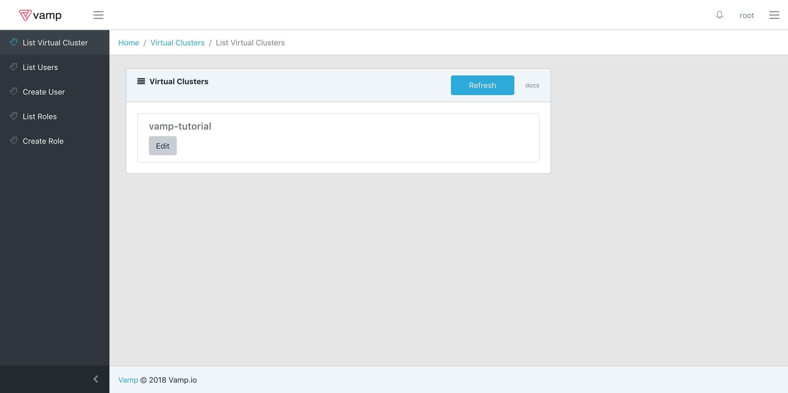

You can now edit the metadata of the Virtual Cluster.

For example, you can associate a Slack channel with a Virtual Cluster by adding the following keys:

- **slack_webhook**: a valid webhook
- **slack_channel**: the name of the channel you want to use. The default is `#vamp-notifications`

This will allow Lamia to send notifications to the specified Slack channel.


### Creating an Application
Once the Virtual Cluster is set up, you need to sure that the Deployments for your Application are created and running.

All deployments require a set of three labels:

- **app**: identifies the Application to which the Deployment belongs.
- **deployment**: identifies the Deployment itself. This is used as a selector for the pods.
- **version**: the version of the Application to which the Deployment belongs. This is used by Istio to dispatch traffic.

You can use the sample [deployments.yaml](samples/deployments.yaml) to create an Application with two Deployments with the same app label and different deployment and version labels.

````
kubectl create -f deployments.yaml
````

deployment.yaml:
````
apiVersion: extensions/v1beta1
kind: Deployment
metadata:
  labels:
    app: vamp-tutorial-app
    version: version1
  name: vamp-tutorial-deployment1
  namespace: vamp-tutorial
spec:
  replicas: 1
  selector:
    matchLabels:
      app: vamp-tutorial-app
      deployment: vamp-tutorial-deployment1
      version: version1
  template:
    metadata:
      labels:
        app: vamp-tutorial-app
        deployment: vamp-tutorial-deployment1
        version: version1
    spec:
      containers:
      - env:
        - name: SERVICE_NAME
          value: version1
        image: magneticio/nodewebservice:2.0.11
        livenessProbe:
          failureThreshold: 5
          httpGet:
            path: /health
            port: 9090
            scheme: HTTP
          periodSeconds: 10
          successThreshold: 1
          timeoutSeconds: 20
        name: deployment1-0
        ports:
        - containerPort: 9090
          protocol: TCP
        readinessProbe:
          failureThreshold: 3
          httpGet:
            path: /ready
            port: 9090
            scheme: HTTP
          periodSeconds: 10
          successThreshold: 1
          timeoutSeconds: 20
---
apiVersion: extensions/v1beta1
kind: Deployment
metadata:
  labels:
    app: vamp-tutorial-app
    version: version1
  name: vamp-tutorial-deployment2
  namespace: vamp-tutorial
spec:
  replicas: 1
  selector:
    matchLabels:
      app: vamp-tutorial-app
      deployment: vamp-tutorial-deployment2
      version: version2
  template:
    metadata:
      labels:
        app: vamp-tutorial-app
        deployment: vamp-tutorial-deployment2
        version: version2
    spec:
      containers:
      - env:
        - name: SERVICE_NAME
          value: version2
        image: magneticio/nodewebservice:2.0.11
        livenessProbe:
          failureThreshold: 5
          httpGet:
            path: /health
            port: 9090
            scheme: HTTP
          periodSeconds: 10
          successThreshold: 1
          timeoutSeconds: 20
        name: deployment1-0
        ports:
        - containerPort: 9090
          protocol: TCP
        readinessProbe:
          failureThreshold: 3
          httpGet:
            path: /ready
            port: 9090
            scheme: HTTP
          periodSeconds: 10
          successThreshold: 1
          timeoutSeconds: 20
````

Assuming the command executed correctly, the deployments will be imported into Lamia.

First, open the Virtual Cluster tab, click on List Virtual Cluster and select `vamp-tutorial`.

Now, you can open the Application tab, click on List Application and you will be presented with the list of the available applications.

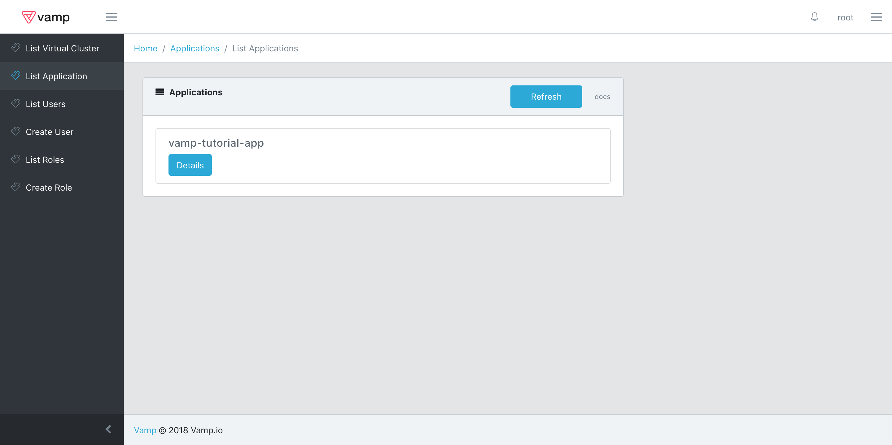

Select `vamp-tutorial-app` to see the list of deployments you just created.


You can compare this with the information presented through `kubectl` by running the following command:

````
kubectl get deploy -n=vamp-tutorial
````

### Exposing Your Application

Once you have your Application running, you can create a Service and a Gateway to expose the Application.

To do this using the UI, start by making sure that you have selected the Virtual Cluster and the Application that you want to expose.

Now open the Service tab, click Create Service and enter the following data, as shown in the screenshot below.

- **Service: Name**: the name of the service, use `vamp-tutorial-service` for the tutorial 
- **Ports: Number**: the port on which the service will be exposed, use `9090` for the tutorial
- **Ports: Target Port**: the port on which the container accepts traffic, use `9090` for the tutorial
- **Ports: Protocol**: the network protocol the service uses, use `TCP` for the tutorial


Then click Submit, to create the Service.

If there were no errors, a Service named `vamp-tutorial-service` will be accessible internally to the Cluster.

You can check the status of this Service using the UI by opening the Service tab, clicking on List Service and selecting `vamp-tutorial-service`.


To check if the Service was created correctly, click Details. You also have the options to Edit or Delete the Service.

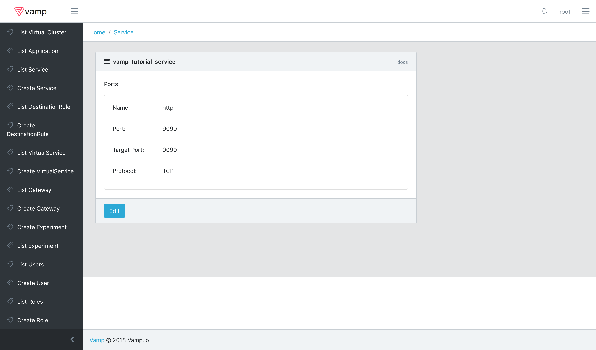

You can compare this with the information presented through `kubectl` by running the following command:

````
kubectl get svc vamp-tutorial-service -n vamp-tutorial
````

Now it's time to expose the Service externally by creating an Gateway.

Open the Gateway tab, click Create Gateway and enter the following data, as shown in the screenshot below.


Then click Submit, to create the Gateway.

If there were no errors, the `vamp-tutorial-service` will now be available externally.

To find the external IP address the `vamp-tutorial-gateway` is using, open the Gateway tab and click on List Gateway.

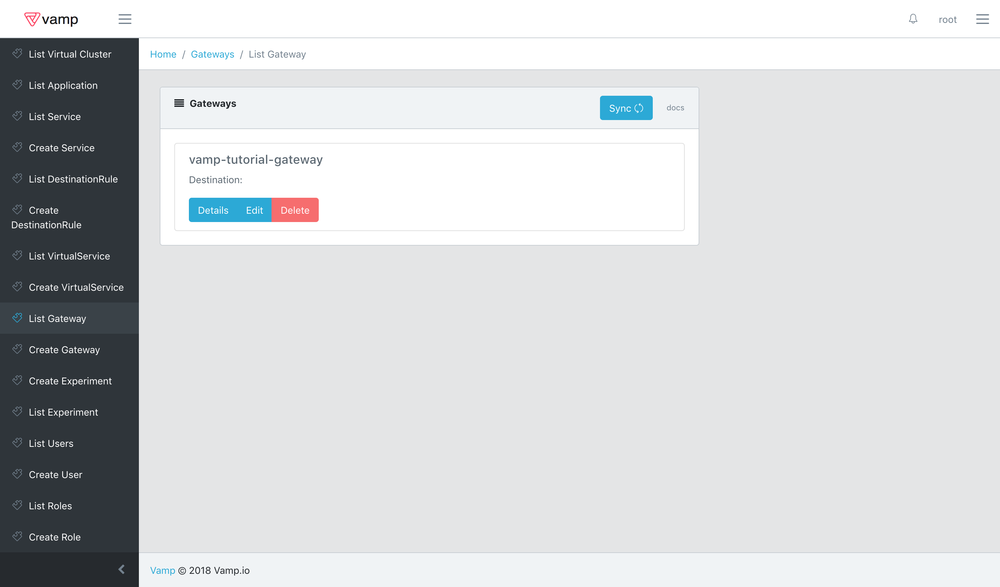

Then select Details and you will find the generated url for your Service.


You can also retrieve this information using `kubectl` by running the following command:

````
kubectl get gateway vamp-tutorial-gateway -n vamp-tutorial
````

If the external IP address is `1.2.3.4` then you can access the service using the following URL:
````
http://1.2.3.4
````

Mind the fact that this link will currently be the same for every Gateway you create, since it referes to an Istio controlled load balanced service which is used by all Gateways to expose services.
By clicking on the url you will notice that the Service is still not reachable. 
The reason for that is that, unlike a Kuebrnetes Ingress, Istio Gateways need a Virtual Service bound to them in order to work properly.
Don't worry though, we will get to that soon.
First of all, however, you need to setup a Destination Rule for you Service.

### Creating a Destination Rule

A Destination Rule is a Istio resource that abstracts from the set of labels defined on the Deployments underlying a Service, by defining one or more Subsets.
Subsets are then referenced by Virtual Services in order to route traffic through the Service.
You can create a new Destination Rule through Lamia by selecting Create DestinationRule and filling the presented form as shown below:


When you filled in the required configuration, just click submit and then check the result in List DestinationRule - details.


To retrieved the created resource through kubectl, run the following command:

````
kubectl get destinationrule vamp-tutorial-destination-rule -n vamp-tutorial
````

Now that the Destination Rule has been set up, it's time to work on the Virtual Service.

### Creating a Virtual Service

A Virtual Service can be used to regulate access to the different versions of an Application.

The Service we created to expose `vamp-tutorial-app` distributes all request equally between the two Deployments that are part of the application. 
To change this behaviour we need to create a Virtual Service that will sit in between the Gateway and the Service.

Open the Virtual Service tab, click Create Virtual Service and enter the following data, as shown in the screenshot below.


Then click Submit, to create the Virtual Service.

If there were no errors, a Virtual Service named `vamp-tutorial-virtual-service` will now be available.

You can check the configuration of this Virtual Service using the UI by opening the Virtual Service tab, clicking on List Virtual Services and selecting `vamp-tutorial-virtual-service`. You should see a configuration like the one shown below.


This configuration tells Istio to distribute traffic equally (50%/50%) among the two versions.

This is the same behaviour you would have with just the Service, so you won't be able to see any difference until you start experimenting with different weights.

**Keep in mind that the weights should always add up to 100, otherwise the configuration will not be applied.**

You can also retrieve the virtual service using `kubectl` by running the following command:

````
kubectl get virtualservice vamp-tutorial-virtual-service -n vamp-tutorial
````

You might have noticed that in the configuration, besides the Gateway you created, there's also another one, named mesh.
Adding this Gateway enables the Virtual Service to be exposed internally.

### Adding Routing Conditions

Let's try now adding more complex conditions to regulate the traffic on the Service.
In order to do that you will have to edit the Virtual Service configuration you just created.
Select List Virtual Service and click on edit.
Now specify the following condition and hit submit.

Open the Gateway tab, click List Gateway, select the gateway and click on edit.

Then add the following condition and hit submit:

````
header "User-Agent" regex "^.*(Chrome).*$"  or header "User-Agent" regex "^.*(Nexus 6P).*$"
````

This will tell the Virtual Service to only pass requests to the Service when the `User-Agent` HTTP header contains either "Chrome" or "Nexus 6P".
You can test the effect of this condition from a browser or with a tool like `cURL` that allows you to send HTTP requests towards your service.
You can now check what happened on kubernetes by running the command:

````
kubectl get virtualservice vamp-tutorial-virtual-service -n vamp-tutorial -o yaml
````

You might also find yourself in a situation in which you want to specify different weights for each condtion.
In order to do that, click on the add button and you will be able to configure a new route with its own condition and set of weights.
It is also important to note that this allows for the selection of different destinations, effectively granting the ability to direct traffic towards multiple Services.
Fot those that dealt with Istio before or that tried the previous version of Vamp Lamia, this is a big change compared to Route Rules.
In the route you added you can now specify the following condition:

````
header "User-Agent" regex "^(?:(?!Chrome|Nexus 6P).)*$"
````

You can then configure the route to forward all traffic towards subset1.
The virtual service configuration will then look like the one shown below.


The effect of adding this new route is that requests with a `User-Agent` HTTP header that contains either "Chrome" or "Nexus 6P" will be equally split between subset1 and subset2, while all other requests will be sent to subset1.
Let's now edit again the gateway and remove the conditions you just specified and the extra route, before moving on to the next step.

### Performing a Canary Release

It's time to try something a bit more complex.
Vamp Lamia allow users to specify Policies on Virtual Services, i.e. automated processes than can alter the Virtual Service configuration over a period of time.
When specifying a new Policy of this kind there are several options, let's start with the simplest one.
Select List Virtual Service - edit and specify the values shown below in the Policies section, then submit.


What you just did will trigger an automated process that will gradually shift the weights towards your target (subset2 in this case).
You will periodically get notifications that show the updates being applied to the virtual service.
As usual you will be able to check the weights status from the Virtual Service's detail.
It is also possible to configure the weight change at each update. The default value is 10, but you can specify it by adding the "step" parameter with the desired value.

This is, of course, a pretty limited example. Usually you would like to put some form of rule to decide which version should prevail.
Lamia can also help you in that scenario.
Go back to the edit screen, remove the policy and reset the weights to 50/50, then submit.

Let's say for example you want to rerun the previous scenario, but checking the healthiness of the two subsets before applying changes.
You can esaily achieve that by editing the Virtual Service as shown in the next image


To verify that everything is working as expected just run this command

````
kubectl replace -f deployment-with-failures.yaml
````

Using the yaml provided in the sample folders, whose content you can find below

````
apiVersion: extensions/v1beta1
kind: Deployment
metadata:
  labels:
    app: vamp-tutorial-app
    version: version2
  name: vamp-tutorial-deployment2
  namespace: vamp-tutorial
spec:
  replicas: 1
  selector:
    matchLabels:
      app: vamp-tutorial-app
      deployment: vamp-tutorial-deployment2
      version: version2
  template:
    metadata:
      labels:
        app: vamp-tutorial-app
        deployment: vamp-tutorial-deployment2
        version: version2
    spec:
      containers:
      - env:
        - name: SERVICE_NAME
          value: version2
        - name: FAILURE
          value: "0.3"
        image: magneticio/nodewebservice:2.0.11
        livenessProbe:
          failureThreshold: 5
          httpGet:
            path: /health
            port: 9090
            scheme: HTTP
          periodSeconds: 10
          successThreshold: 1
          timeoutSeconds: 20
        name: deployment1-0
        ports:
        - containerPort: 9090
          protocol: TCP
        readinessProbe:
          failureThreshold: 3
          httpGet:
            path: /ready
            port: 9090
            scheme: HTTP
          periodSeconds: 10
          successThreshold: 1
          timeoutSeconds: 20
````

This will inject errors on 30% of the requests going towards deployment2 and, consequently, cause the Policy to shift weights towards subset1, despite the fact that subset2 is the declared target.
Obviously nothing will happen unless you actually send requests to the service.
There's an easy way to do that thanks to the specific image we are using for this tutorial.
Go to List Gateway and open the details for the Gateway you previously created and click the link to your Service and add /ui at the end to get to this ui.


Now just input the url to your service ( http://vamp-tutorial-service:9090 ) into the empty field and this will both trigger continuous requests towards the service and show the real distribution over the two deployments, including the errors (highlighted in red).
This tool is not really part of Vamp Lamia, but it comes in handy to test the behaviour of Virtual Services and Istio.


You can check the distribution of traffic both from the tool itself or by selecting List Virtual Service and clicking on metrics.
This will present you with the interface shown below.


After you are done experimenting with this Policy you can edit the Virtual Service back to normal, but keep the deployments in the current state for the next steps.

#### Metric based canary release

You managed to create a canary release Policy that takes into account the health of your application, but what if you wanted to use some different metric to control the behaviour of the policy?
In order to do that you can edit the Virtual Service as shown below


As you can see besides changing the type of Policy you also need to specify the **metric** parameter which will tell Lamia which metric or combination of metrics to use.
In this scenario the value we are using is:

````
internal_upstream_rq_2xx / upstream_rq_total
````

In this case we are basically replicating the behaviour from the health based canary release by calculating the ratio of successful responses over the total number of requests
Metrics names are loosely based on Prometheus metrics names stored by Envoy (they are usually the last part of the metric name).
Some of the available metrics are:

- **internal_upstream_rq_200**
- **internal_upstream_rq_2xx**
- **internal_upstream_rq_500**
- **internal_upstream_rq_503**
- **internal_upstream_rq_5xx**
- **upstream_rq_total**

This type of Policy, however, comes with a limitation: you can only specify one condition, that is "select the version with the best metric".
What if you wanted to have more complex conditions?

#### Custom canary release

To do that you would have to use the last type of Policy available at the moment and configure the Gateway as shown below,
by specifying the condition

````
if ( ( metric "vamp-tutorial-service" 9090 "subset1" "internal_upstream_rq_2xx" / metric "vamp-tutorial-service" 9090 "subset1" "upstream_rq_total" ) > ( metric "vamp-tutorial-service" 9090 "subset2" "internal_upstream_rq_2xx" / metric "vamp-tutorial-service" 9090 "subset2" "upstream_rq_total" ) ) { result = "vamp-tutorial-service 9090 subset1"; } else if ( ( metric "vamp-tutorial-service" 9090 "subset1" "internal_upstream_rq_2xx" / metric "vamp-tutorial-service" 9090 "subset1" "upstream_rq_total" ) < ( metric "vamp-tutorial-service" 9090 "subset2" "internal_upstream_rq_2xx" / metric "vamp-tutorial-service" 9090 "subset2" "upstream_rq_total" ) ) { result = "vamp-tutorial-service 9090 subset2"; } else { result = nil; } result
````

in the value field for the metric parameter

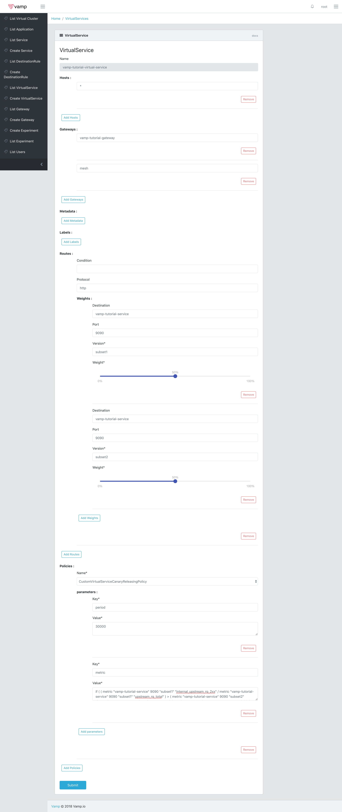

As you can probably understand by looking at the expression above, this Policy will again replicate the behaviour of the previous Policies, but it will allow for much greater flexibility.
You will now be able to specify different versions based on the conditions you are verifying and also to return no version at all (by returning nil) when you want the Policy to not apply any change.

You can now keep on experimenting with the Virtual Service, trying new things. Keep in mind that if you want to return the deployments to the previous state (in which no errors are returned) you can do that by executing

````
kubectl replace -f deployments.yaml
````

### Creating an Experiment

Experiments are a new feature introduced with Lamia 0.2.0.
They allow to quickly set up virtual services for A/B testing of different versions.
In order to try out Experiments you can execute [demo-setup.sh](samples/experiment-demo/demo-setup.sh).
If everything works correctly, this will produce the following output

````
namespace "vamp-demo" created
deployment "deployment1" created
deployment "deployment2" created
````

At this point you will have a new namespace named vamp-demo containing two versions of a simple e-commerce, that wil be imported by Lamia into a single application.
Now, before you can proceed with setting up the Experiment, you will first have to create a Service a Destination Rule and a Gateway for the Experment to use.
Since you already did that in the previous steps of this tutorial, you should be able to go through it quickly by referring to the configurations shown below.


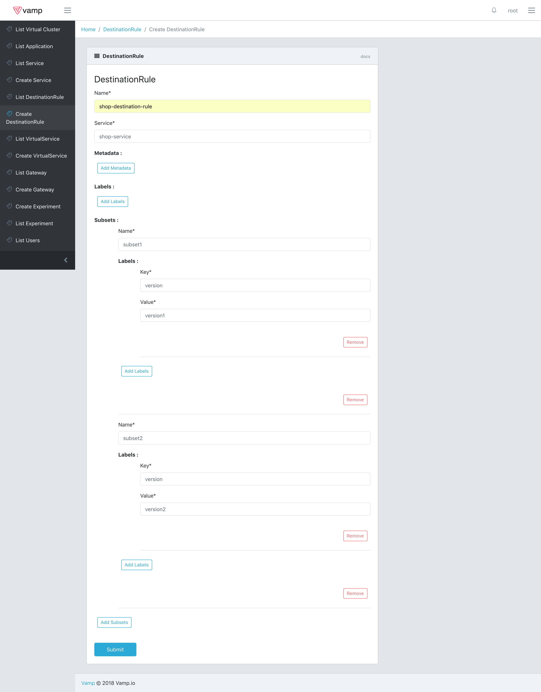

Once everything is ready you can set up the Experiment itself.
Select Create Experiment and submit the following configuration.

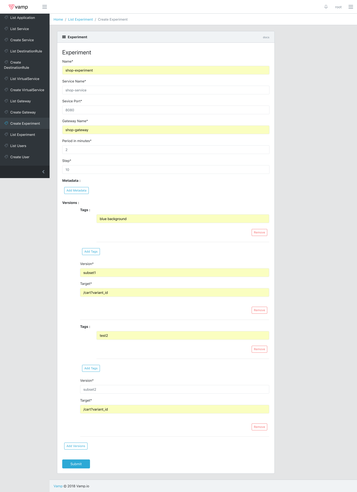

To clarify a bit what is going to happen when you submit, let's first go through the purpose of each field:

- **Service Name**: the name of the Service on which you want to run the A/B testing.
- **Service Port**: the Service port to use.
- **Gateway Name**: the Gateway through which the Service will be exposed.
- **Period in minutes**: the time interval in minutes after which periodic updates to the configuration will happen.
- **Step**: the amount by which the route's weights will shift at each update.
- **Tags**: a descriptive value for a specific version of the service.
- **Subset**: the subset of the service.
- **Target**: the url that we want the users to reach to consider the test a success.

When the form has been correctly filled and submitted the Experiment will first save its configuration and then create a Virtual Service with the same name.
By clicking on List Virtual Service you will be able to see this new Virtual Service and check its configuration, although you won't be able to change it or delete it directly.
Below you can see how ths configuraiton should look:

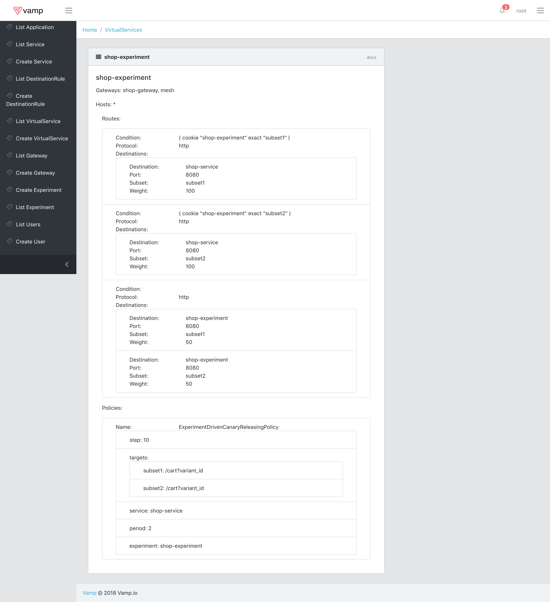

We realise this configuration can feel rather obscure, so let's walk through it together.
The Virtual Service defines three routes. The first two are easy to understand: they each lead to one of the deployed versions. The third one is evenly load balancing between two versions of a Cookie Server.
The purpose of this configuration is to direct new visitors towards the Cookie Server which will then set cookies identifying them as a specific user and assigning them to one of the configured subsets.
Once this is done, the Cookie Server redirects the user back to the original url, sending him back through the Virtual Services. This time, however, having a Subset Cookie, one of the conditions set on the first two routes applies and the user is forwarded to a specific version of the landing page. This is seamless in browsers, so users don't experience any interruption, and adds a neglectable overhead, since it affect only one call per user .
Thanks to our reliance on cookies, we are able to provide users with a consistent experience while continuing our test, meaning that subsequent requests coming from the same user in a short period of time will always go to the same version.
Depending on the test results, the policy defined on the Virtual Service will then move more users to more successful version, i.e. versions with a better ratio of users that reached the target over total number of users that reached the landing page.
This is of course achieved by changing the weights of the Cookie Servers routes according to the Step value defined in the Experiment configuration.

Besides the Virtual Service itself, the Experiment is also managing a set of other resources:

- one Cookie Server Deployment per Subset involved in the test.
- a Service definition grouping the Cookie Servers.
- a Destination Rule bound to the Cookie Servers' Service.

All these resources are not visible in Lamia and will be automatically deleted when the Experiment is removed.

## Advanced Networking

To better showcase what Vamp Lamia and Istio can do, let's now try and setup an entire environment with multiple virtual clusters and deployments.
The final goal of this example is shown in the image below.

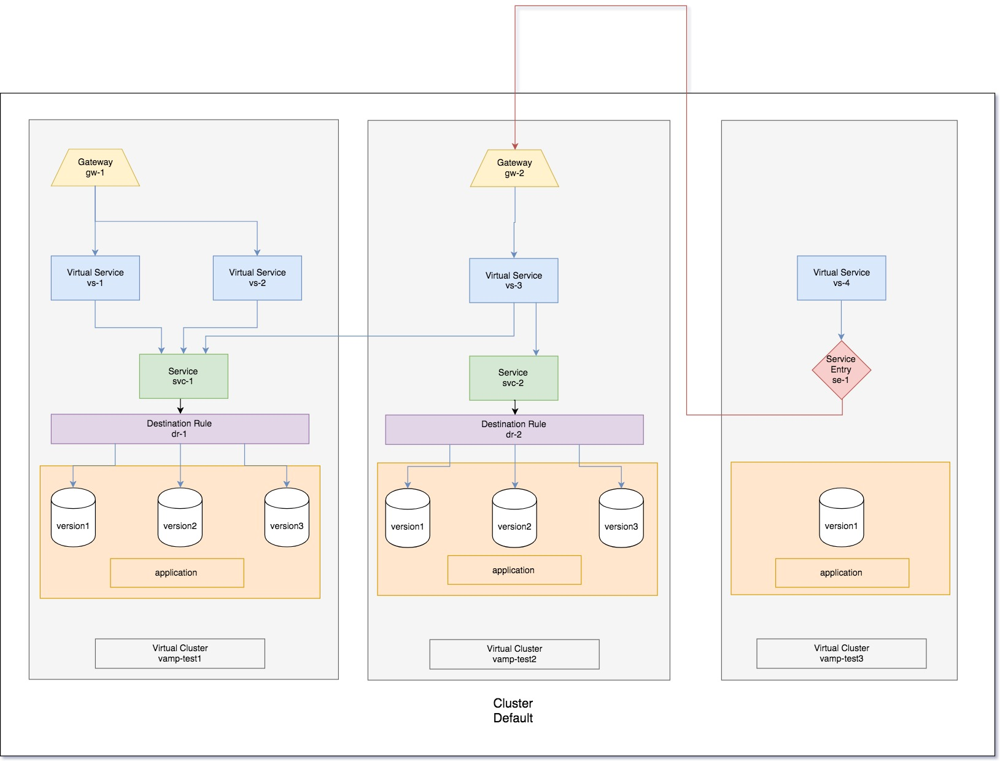

As you can see, at the end of this tutorial you will have three Virtual Clusters, each with its own deployments and a different networking infrastructure.
**Before continuing make sure to move to a new cluster or cleanup resources created in the previous steps of the tutorial, in order to avoid conflicts especially on the Gateway level.**
The first step is to set up the Virtual Clusters and Deployments.
You can do that by applying the [full-example-setup.yaml](samples/full-example-setup.yaml) with the command:

````
kubectl create -f full-example-setup.yaml
````

By logging into vamp you will now be presented with the following situation.

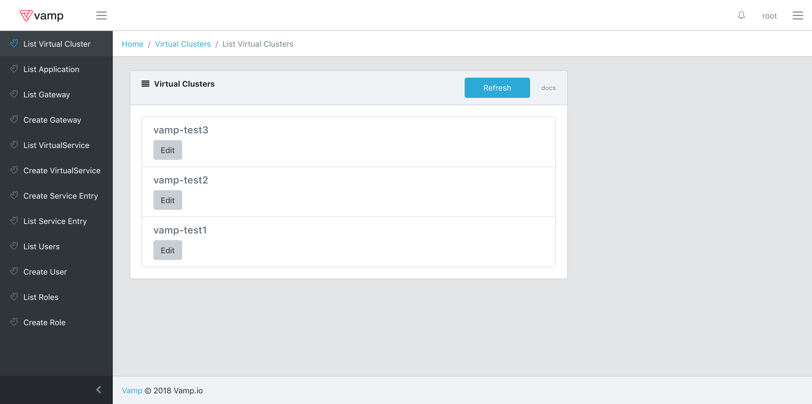

As you can see the Virtual Clusters have all been imported and by selecting them you will be able to see the Applications and the Deployments they contain.
Let's now focus on Virtual Cluster vamp-test1.
First of all let's select Application app1 and create a Service and Destination Rule.


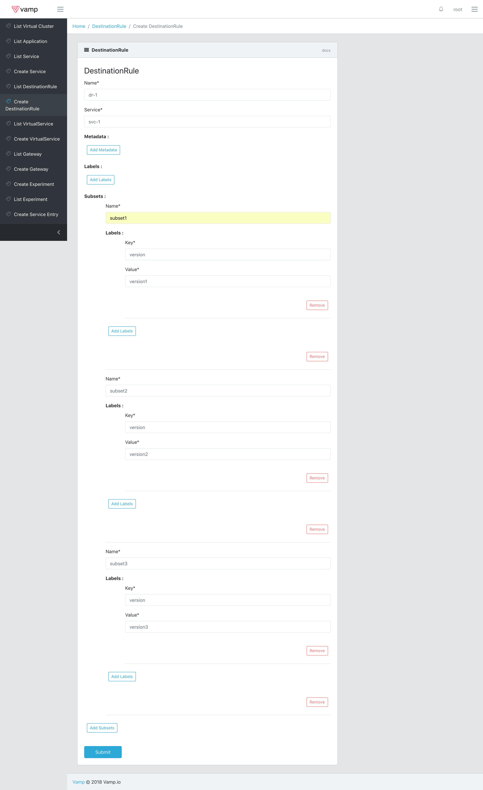

Now you can set up a Gateway to expose the Service you just created to the outside. For this example it is necessary to define host names for the gateways we are going to create.
So, choose two host names and specify them in the Gateway configuration as shown below.

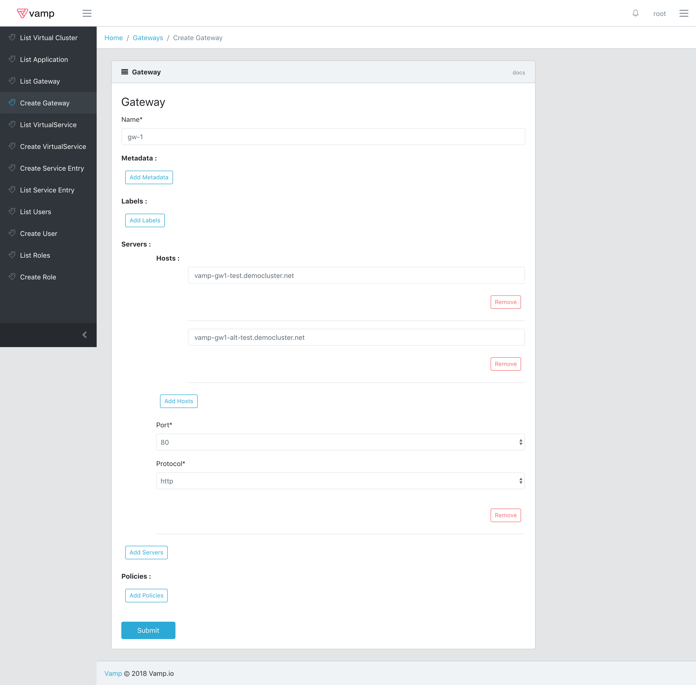

Note that what you just did is not enough to map the specified names to the Gateway's ip. You will have to take care of that manually by using either Google DNS or any other online service like, for example, name.com or DNSDynamic.
Now that the Gateway is setup you need only to create a Virtual Service in order to finally access the Service.
To do that, use the following configuration. **Take care to specify one of the host names you defined in the Gateway and not the one used in the example**


Shortly after submitting you will be able to access the Service with the first one of the host names you defined.
Let's map also the other host name, using a second Virtual Service.

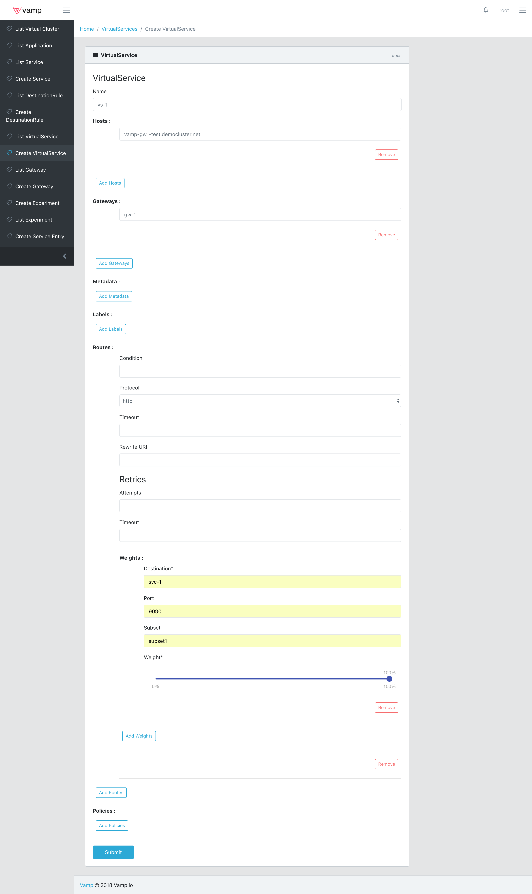

If you try now calling the second host name you will be sent to subset2 in the Service you created.
You now are able to access two different subsets of your Service based on the host name you use.

This was easy enough.
Let's now try something different.
Go back to List Virtual Cluster and select vamp-test2.
This time we want to create a single Virtual Service that will respond to a single host name to the outside world and that will dispatch requests to either Service svc-1 or a new Service based on their url while at the same time rewriting that url.
Let's start with the easy stuff, that is creating the Service, Destination Rule and Gateway.

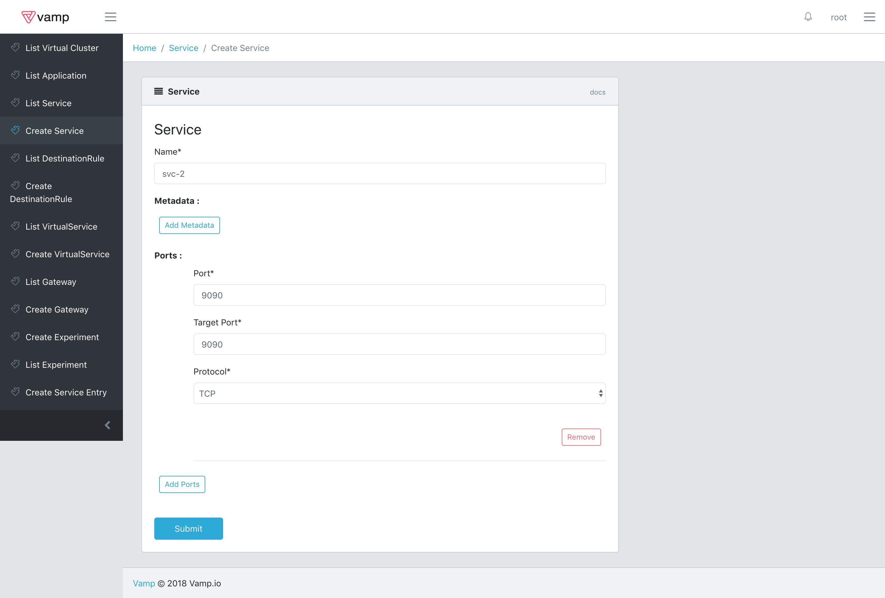


As you can see the setup is basically identical to what we did in Virtual Cluster vamp-test1. The only significant difference is that we need to use a new host name for the Gateway definition.
Let's now get to the Virtual Service.
The Virtual Service should dispacth requests starting with '/service1' to svc-1 and requests starting with '/service2' to svc-2. At the same time those url should be rewritten to a simple '/'.
In order to do that you need to define two conditional routes with the following conditions:

````
uri prefix "/service1"
````

````
uri prefix "/service2"
````

and also specify the value '/' in the rewrite field.
Also worthy of note is the fact that, since svc-1 resides in a different Virtual Cluster, we have to use its fully qualified name to be able to reach it, that is svc-1.vamp-test1.svc.cluster.local.
Fo reference you can find the full configuration below.


If you try now to send requests to the specified host name with the appropriate url you will be redirected to the correct Service.
Our work with vamp-test2 is finished, let's now focus on the last Virtual Cluster: vamp-test3.
In this Virtual Cluster, as shown in the initial graph, we want to allow access to Gateway gw-2 from outside the Cluster.
**Note that this last example can be set up even on an entirely different cluster from which the original Cluster can be reached. We are limiting ourselves to use a Virtual Clutser for simplicty sake.**
External services are normally not reachable from pods belonging to the Istio Mesh, hence we have to somehow make the host defined on Gateway gw-2 accessible. Service Entries are an Istio resource that can do just that.
We are thus going to create one of them with this configuration.

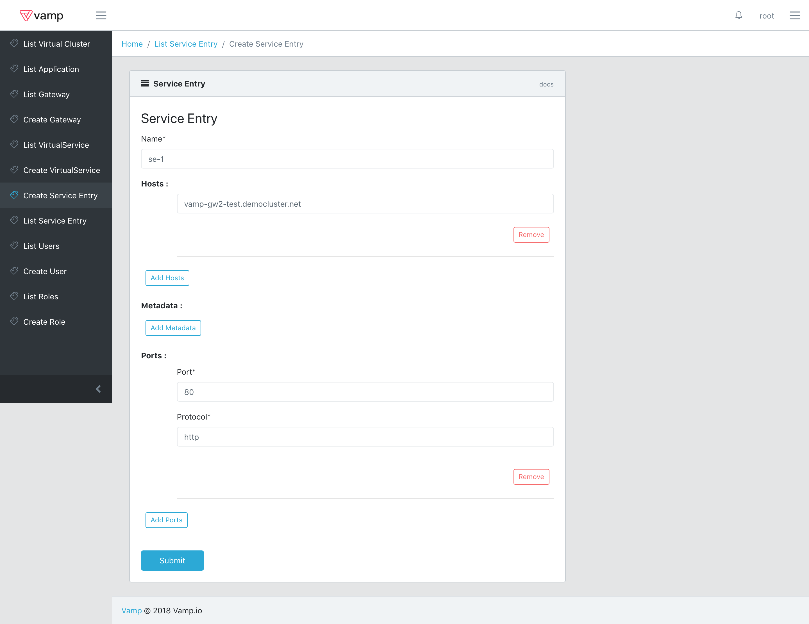
 
By using kubectl to log into one of the pods running into the vamp-test3 namespace you will now be able to send requests to Gateway gw-2 going outside the cluster, like this:


````
curl vamp-gw2-test.democluster.net
````

where vamp-gw2-test.democluster.net should be replaced by the host name you defined previously.
Thanks to the Service Entry you can now also add a Virtual Service definition that references the externa service and use it to define timeouts or retry policies as shown in the image.

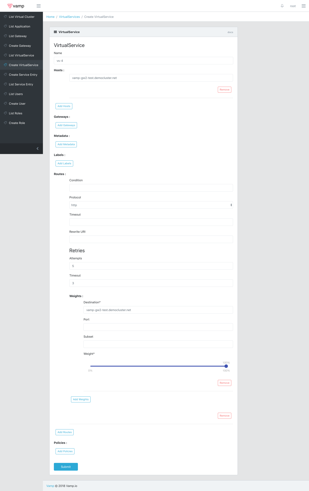

This concludes the tutorial, but feel free to keep on experimenting on the environment you just created. It makes for a good basis to try different setups and explore the available configuration options.

## API

All the operations performed during this tutorial are also achievable through the API. You can reach the documentation for Lamia API at the following url:

````
http://1.2.3.4/swagger
````

where 1.2.3.4 should be replaced with your ip.
Mind the fact that loading the documentation might take some time.


